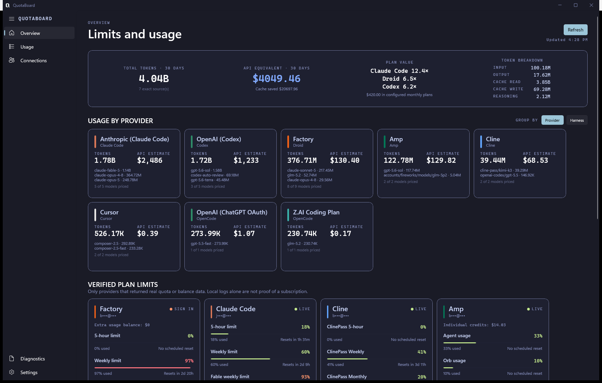
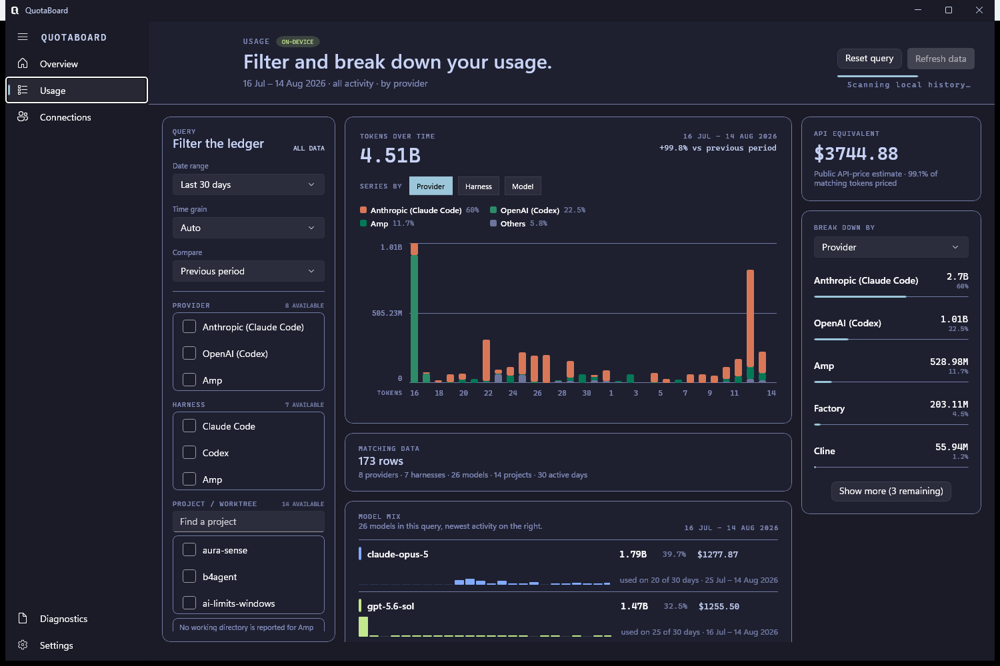

  

# QuotaBoard for Windows

QuotaBoard is a Windows utility app that provides AI limits and token analytics across providers.

It reads the existing CLI sessions and local usage histories on your PC to show subscription limits, reset times, token usage, and API-price estimates. Live limit checks go directly to each provider; QuotaBoard has no backend or telemetry.

## Supported providers ✨

- Codex
- Claude Code
- Factory (Droid)
- GitHub Copilot
- Amp
- Google Antigravity
- OpenCode
- Cursor
- Cline

Coverage varies by provider: QuotaBoard displays available limits where a provider exposes them and exact local token usage where its installed tools record it.

Detection is read-only, and sign-in state is discovered from the CLI logins you already have — there is nothing to configure.

Usage adds up the token histories those tools already write to disk, so you can filter a date range and break it down by provider, harness, model, or project.

Diagnostics shows which source answered for each provider, how long it took, and what to do about the ones that did not.

## Quick start 🚀

1. Download `QuotaBoard-<version>-win-x64.zip`, or `win-arm64` for Snapdragon and other ARM machines, from [Releases](https://github.com/baranbingol1/quotaboard/releases).
2. Extract it anywhere and run `QuotaBoard.exe`. There is no installer, and no administrator rights are required.
3. Select **Refresh**. QuotaBoard detects supported tools already signed in for the current Windows user.

QuotaBoard releases are unsigned, so Windows SmartScreen may require **More info → Run anyway**. Download them only from the official Releases page.

Requires Windows 10 21H2 (build 19045) or newer. The runtime is self-contained, so there is no .NET to install.

QuotaBoard stores its local database, pricing cache, and preferences in `%LOCALAPPDATA%\QuotaBoard`. Uninstalling preserves this data; delete that folder to remove it.

## Contributing 🛠️

Development, test, publishing, and repository-layout guidance is in [CONTRIBUTING.md](CONTRIBUTING.md).
Coding-agent commands and guardrails are in [AGENTS.md](AGENTS.md).

## License 📄

QuotaBoard is released under the [Apache License 2.0](LICENSE). Every source
file carries an `SPDX-License-Identifier: Apache-2.0` header.

The bundled Familjen Grotesk and Azeret Mono fonts are used under the SIL Open
Font License 1.1; their license texts ship alongside them in
[`src/AiLimits.App/Assets/Fonts`](src/AiLimits.App/Assets/Fonts).

Model pricing metadata is fetched at runtime from [models.dev](https://models.dev/).
QuotaBoard records the accepted catalog's timestamp and SHA-256 hash with every
API-equivalent figure it displays.

## Release integrity

Official releases are built from this public repository using GitHub Actions.
Each archive and SPDX SBOM has a SHA-256 sidecar and a GitHub build-provenance
attestation. Verify an archive with `gh attestation verify <archive> --repo
baranbingol1/quotaboard`. See the [privacy policy](PRIVACY.md) for QuotaBoard's
data and network practices.
